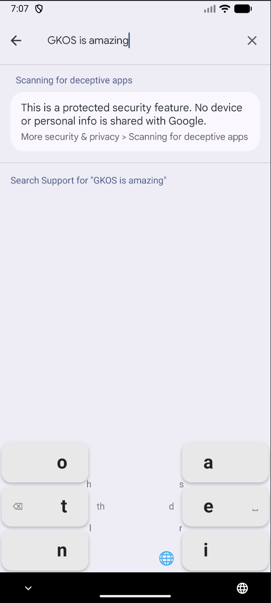
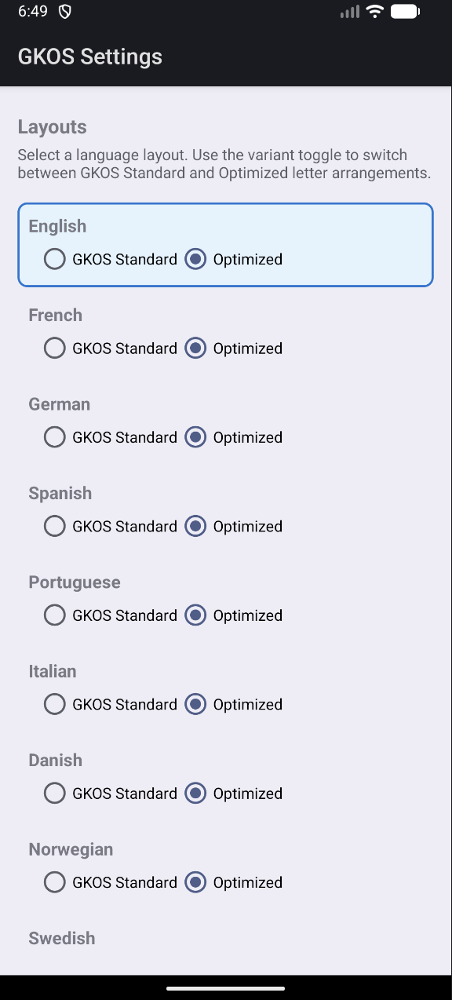

# GKOS2 — GKOS Keyboard for Android

A chorded keyboard for Android implementing the
[GKOS (Global Keyboard Open Standard)](https://gkos.com/).

This is a reboot of the original GKOS Keyboard app from 2014, which is no
longer available on the Google Play Store.

| Keyboard | Settings |
|-----------|---------|
|  |  |

## Features

- **6-key chorded input** — tap or swipe across keys to form chords
- **18 language layouts** — English, French, German, Dutch, Spanish, Portuguese,
  Italian, Danish, Norwegian, Swedish, Finnish, Greek, Russian, Korean,
  Esperanto, Estonian, Icelandic, Ukrainian
- **Dual layout variants** — GKOS Standard and frequency-optimized for each
  language (where available)
- **Predictive text** — word suggestions from bundled frequency lists and a
  personal user dictionary
- **Emoji picker** and **Unicode hex input** mode
- **Progressive disclosure** — primary and secondary outcomes displayed on and
  around keys so you can discover chords at a glance
- **Dark and light mode** support
- **No network permissions** — all data stays on your device

## How it works

GKOS uses just six keys — three on each side of the screen — to produce the
full range of characters, numbers, and symbols. Each key can be pressed
individually, or multiple keys can be combined into a **chord** to select a
different character.

On a touchscreen you don't need to press multiple keys simultaneously. Instead,
you can **swipe** across adjacent keys in a single gesture: every key your
finger passes through is added to the chord, and the character is emitted when
you lift your finger. This makes one-handed typing fast and comfortable.

The keyboard displays **primary outcomes** (what the next tap or swipe will
produce) in large text on each key, and **secondary outcomes** in smaller text
around the keys so you can discover multi-key chords at a glance.

Multiple language layouts are supported and can be selected from the GKOS
Settings screen or via the globe icon between the key columns.

## Build

Requires Android SDK (`ANDROID_HOME`) and Java 17+.

```bash
./gradlew assembleDebug
```

APK output: `app/build/outputs/apk/debug/app-debug.apk`

Deploy to device/emulator:

```bash
./gradlew installDebug
```

Release bundle (for Google Play):

```bash
./gradlew bundleRelease
```

## Tests

```bash
./gradlew testDebugUnitTest
```

Runs 69 unit tests covering chord mapping, layout data, mode resolution,
XML parsing of all layout files, and predictive text dictionaries.

## Setup

1. Install Android SDK (via Android Studio or command-line tools).
2. Set `ANDROID_HOME` to your SDK path (e.g. `~/Library/Android/sdk` on macOS).

## License

This project is licensed under the
[GNU General Public License v3.0](https://www.gnu.org/licenses/gpl-3.0.html).
See [COPYING](COPYING) for the full text.

## Author

Chris Burdess
